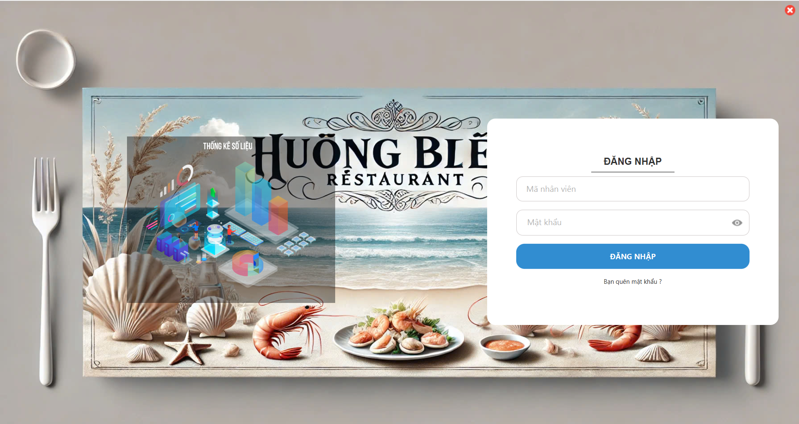
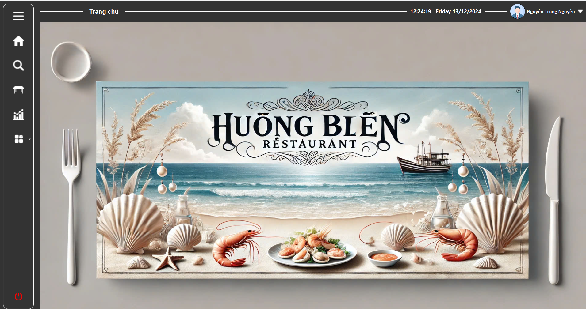
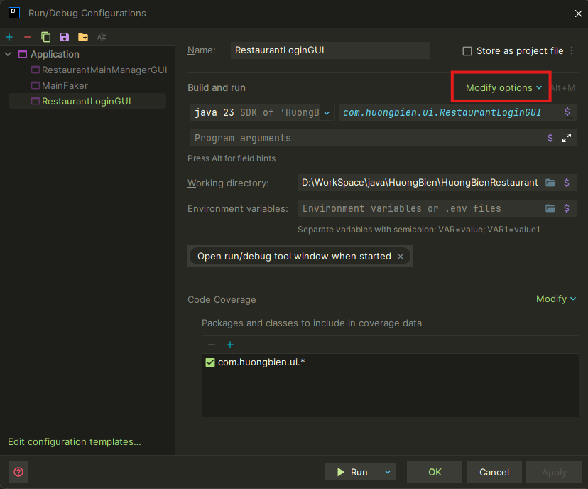
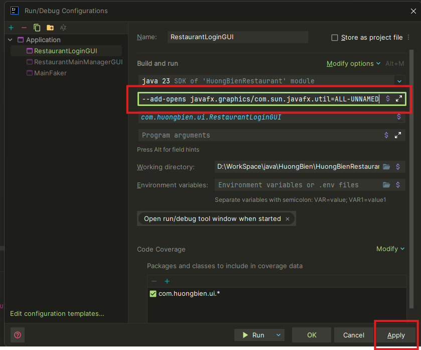

# 🍾HuongBien Restaurant🍻

## Mô tả dự án

Dự án **HuongBien Restaurant** là đồ án môn phát triển phần mềm. Là phần mềm quản lý đặt bàn được xây dựng nhằm hỗ trợ hoạt động của nhà hàng Hương Biển. Phần mềm được phát triển với mục tiêu tối ưu hóa quy trình làm việc, nâng cao hiệu suất kinh doanh, giảm thiểu sai sót và cải thiện trải nghiệm khách hàng.

_*Giao diện đăng nhập*_




_*Giao diện trang chủ*_



## Danh sách thành viên

- Nguyễn Trần Gia Sĩ **🌟LEADER🌟** (_*giasinguyen Nguyễn Trần Gia Sĩ*_)
- Nguyễn Trung Nguyên **🗿DB & BE DEVELOPER🗿** (_*NguyenNguyen0 nguyennguyen0*_)
- Nguyễn Văn Minh **👑FULL-STACK DEVELOPER👑** (_*nvminh162 Nguyen Minh (paul)*_)
- Đào Quốc Tuấn **💋TECHNICAL WRITER💄** (_*daoquoctuan972*_)

## Các công nghệ được sử dụng

- **Ngôn ngữ lập trình**: Java
- **Công cụ phát triển**: IntelliJ IDEA
- **Giao diện người dùng**: JavaFX
- **Cơ sở dữ liệu**: Microsoft SQL Server
- **Quản lý dự án**: Git và GitHub

## Tính năng chính

1. **Quản lý đặt bàn**:
   - Tạo, sửa, hủy đơn đặt bàn.
   - Kiểm tra trạng thái bàn trống và gợi ý bàn phù hợp.
2. **Quản lý khách hàng**:
   - Thêm mới, chỉnh sửa thông tin khách hàng.
   - Theo dõi khách hàng thân thiết và áp dụng ưu đãi.
3. **Quản lý hóa đơn**:
   - Tính tiền và in hóa đơn.
   - Tìm kiếm hóa đơn khi cần thiết.
4. **Thống kê và báo cáo**:
   - Báo cáo doanh thu theo ngày, tuần, tháng.
   - Thống kê số lượng khách và tình trạng sử dụng bàn.
5. **Quản lý nhân viên**:
   - Theo dõi thông tin nhân viên.
   - Quản lý ca làm việc và đánh giá hiệu suất.

## Cách cài đặt và chạy dự án

### Yêu cầu hệ thống

- **Java**: JDK 23 hoặc mới hơn
- **Javafx**: bản 23 hoặc mới hơn
- **OpenCV**: bản 4.5.1 hoặc mới hơn
- **IntelliJ IDEA**: Bản Community hoặc Ultimate
- **SQL Server**: SQL Server 2012 hoặc mới hơn
- **Môi trường phát triển**: Windows 10 và Windows 11

### Hướng dẫn cài đặt

1.  **Clone repository từ GitHub:**

      ```bash
      git clone https://github.com/NguyenNguyen0/HuongBien.git
      ```

2.  **Cấu hình file môi trường `.env`**

      Để dự án hoạt động đúng, bạn cần tạo file `.env` trong thư mục gốc của dự án và thêm các thông tin cấu hình như sau:

      

      ```plaintext
      # DATABASE
      DB_URL="jdbc:sqlserver://localhost:1433;databaseName=HuongBien;encrypt=true;trustServerCertificate=true;loginTimeout=30" # for localhost
      DB_USER="" # database username
      DB_PASSWORD="" # database password

      # EMAIL
      EMAIL_USERNAME="restaurant@example.com"
      EMAIL_PASSWORD="xxxx xxxx xxxx xxxx"
      ```

3. **Cấu hình VM config**

      Cần thêm cấu hình VM để chạy dự án, cho đường dẫn SDK của bạn vào 1 trong các file `RestaurantLoginGUI.java` (_*app bắt đầu từ đây*_),  `RestaurantMainManagerGUI.java` hoặc `RestaurantMainStaffGUI.java`. Cấu hình như sau:

      **Cấu hình VM**: Thay `<your path>` thành đường dẫn javafx-sdk trên máy bạn

      ```plaintext
      --module-path <your path>  --add-modules javafx.controls,javafx.fxml,javafx.media --add-opens javafx.graphics/com.sun.javafx.scene=ALL-UNNAMED  --add-opens javafx.graphics/com.sun.javafx.sg.prism=ALL-UNNAMED  --add-opens javafx.base/com.sun.javafx.reflect=ALL-UNNAMED  --add-opens javafx.graphics/com.sun.javafx.util=ALL-UNNAMED
      ```

      **Các bước cấu hình**

      1. **Mở configuration của file đang chạy chọn Edit** 

      


      2. **Chọn modify options**

      


      3. **Chọn Add VM options**

       

      4. **Dán VM config vào VM options và chọn Apply**

      

4. **Cấu hình thư viện opencv**

      1. **Mở project structure**

      

      2. **Chọn sửa module opencv**

      

      3. **Mở đường dẫn đến opencv**

      

      4. **Chọn file .dll của java trong opencv**

      

      5. **Cuối cùng chọn OK và apply**

      

## Lời kết

Dự án HuongBien Restaurant là kết quả của sự nỗ lực và phối hợp chặt chẽ giữa các thành viên trong nhóm. Với mục tiêu tối ưu hóa quy trình quản lý nhà hàng, phần mềm không chỉ giúp giảm tải công việc cho nhân viên mà còn nâng cao trải nghiệm khách hàng và cải thiện hiệu suất kinh doanh.

Chúng tôi hy vọng rằng phần mềm này sẽ không chỉ đáp ứng tốt các yêu cầu hiện tại của nhà hàng mà còn tạo tiền đề cho những cải tiến và phát triển trong tương lai. Sự phản hồi và góp ý từ người dùng sẽ là động lực để nhóm tiếp tục hoàn thiện sản phẩm, mang lại giá trị cao hơn cho nhà hàng và khách hàng.

Cảm ơn các giảng viên, bạn bè và tất cả những người đã hỗ trợ và đồng hành cùng chúng tôi trong suốt quá trình thực hiện dự án này.

Nhóm phát triển: Nhóm 2

**Leader**: Nguyễn Trần Gia Sĩ
**Developers**: Nguyễn Trung Nguyên, Nguyễn Văn Minh
**Technical Writer**: Đào Quốc Tuấn

💡 Mọi góp ý xin gửi về email: huongbienrestaurantcskh@gmail.com